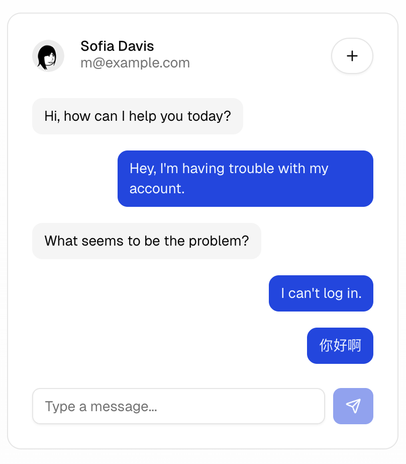

# 需求 聊天功能

## 需求描述

- 添加消息发送页面
- 页面底部展示消息输入和发送按钮
- 消息发送后展示在页面顶部
- 消息发送后清空输入框
- 服务端返回的消息展示在左侧，[text](../../examples/src/views/Demo1.vue) 结合demo1页面的业务逻辑，服务端的返回使用a2ui render 组件去展示

- 新建路由 Demo2.vue
- 页面组件采用 shadcn-vue 组件库, css 框架使用 tailwindcss
- examples 页面使用 shadcn-vue 组件库，这个examples页面单独安装shadcn-vue组件库，不要采用a2ui-vue组件库中的

## UI设计

参考这个图片

- 页面采用上下布局，上面展示消息列表，下面展示消息输入框和发送按钮
- 消息列表采用 shadcn-vue 组件库中的 Card 组件
- 消息输入框采用 shadcn-vue 组件库中的 Input 组件
- 发送按钮采用 shadcn-vue 组件库中的 Button 组件

## bugFix

- 修复 a2uiRender组件没有渲染出内容的问题
- 修复 聊天组件没有固定在底部的问题
- 修复 发送按钮宽度没有起作用的问题
